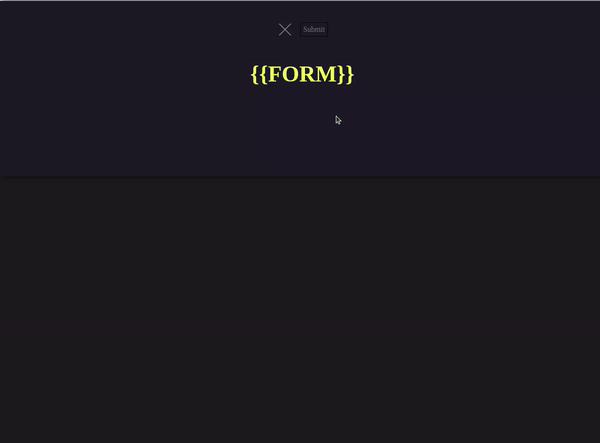

## Visualize Inventory Tracking and Asset Management for a Distribution Warehouse  

**Creating my own project from this course**  
[https://www.udemy.com/course/the-web-developer-bootcamp/](https://www.udemy.com/course/the-web-developer-bootcamp/)  

Course is divided into multiple sections that require progressions of skillset from the previous lesson in order to move forward into the next lesson. 

_**Note:**_  
_Although the lessons are worth documenting themselves, this repository is mainly focused on one project and how that project was used to exemplify the progression of skillsets needed to continue moving forward in this course._  

**Data Model for the project**  

I felt like a non-linear approach to our data structure would serve us best if we are to attempt a NoSQL architecture utillizing MongoDB and JSON parameters  

I felt like a divide and conquor strategy would be best for the architecture of this database model, so I went with a Binary Search Tree (BST) and designed it as balanced.

**I'll continue to build on this as I progress into this project, even though this is not part of any lesson within the Udemy WebDev course*

Each Section quickly summarizes the scope of the lesson to get a better understanding of each phase in the project:
- **[HTML](/HTML)** [[The Essentials](HTML/README.md/#section-1-the-essentials), [Semantics](HTML/README.md/#section-2-semantics), [Forms and Tables](HTML/README.md/#section-3-forms-tables)]
- **[CSS](/CSS)** [[Basics and Selectors](https://github.com/B-Renz/Udemy-WebDev/tree/main/CSS#section-1-basics-selectors-and-specificity), Box Model and Advanced Properties, Responsive and Flex Box, Frameworks and Bootstrap]
- Javascript [Basics, Strings and More, Decision Making, Arrays, Object Literals, Functions, Callbacks and Array Methods, Advanced]
- DOM
- Score Keeper
- Async Javascript
- AJAX and APIs
- Prototypes, Classes and OOP
- Node JS
- JSON
- Express
- Templating
- RESTful APIs
- MongoDB
- Mongoose with Express
- YelpCamp [CRUD, Basic Styles, Errors and Validating Errors, Reviews Modeling, Restructuring and Flash, Authentication, Authorization, Deploying]

**Design Layout**  
This is just a basic design layout to get things started. 

Essentially, there are three sections: Form, Fetched-Data, and Map
Form will act as a collapsable menu that controls what data is viewed within the Fetched-Data section
Fetched-Data section will have data items that can control the display of the Map section

