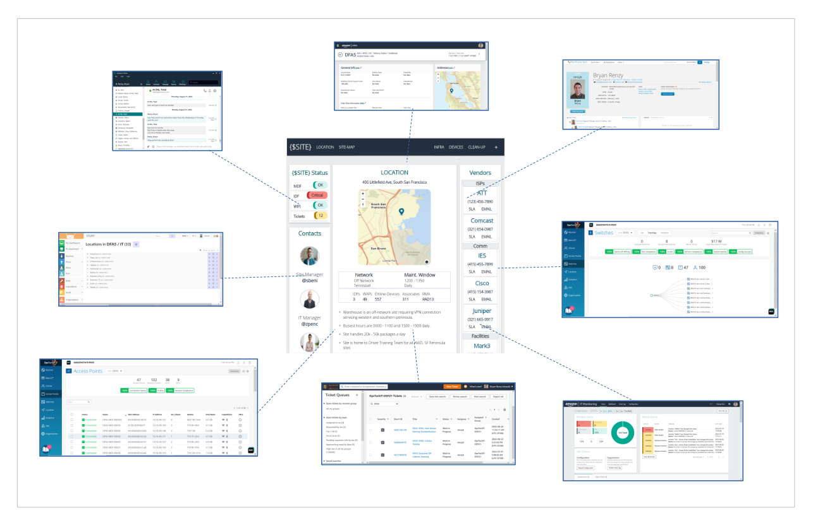
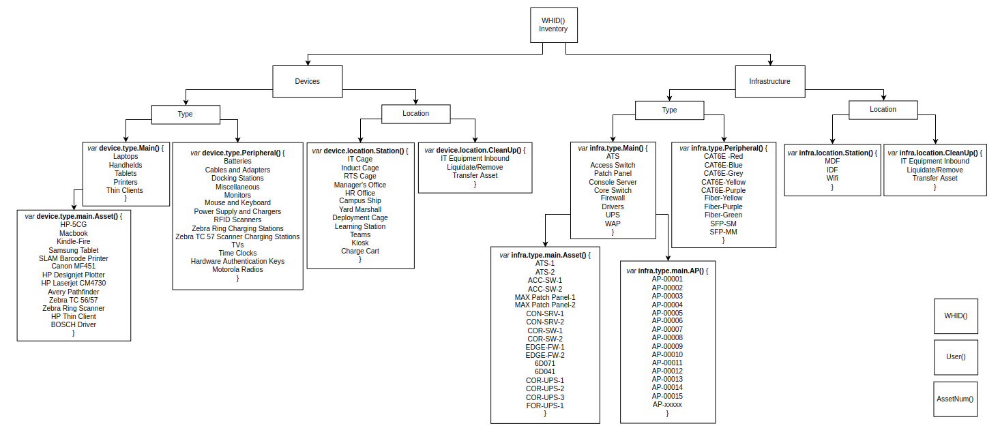
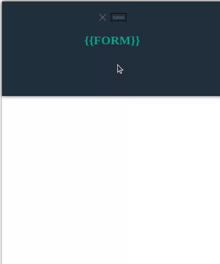

# **Visualize Inventory Tracking and Asset Management for a Distribution Warehouse**  

**Creating my own project from this course**  
[https://www.udemy.com/course/the-web-developer-bootcamp/](https://www.udemy.com/course/the-web-developer-bootcamp/)  

Course is divided into multiple sections that require progressions of skillset from the previous lesson in order to move forward into the next lesson. 

_**Note:**_  
_Although the lessons are worth documenting themselves, this repository is mainly focused on one project and how that project was used to exemplify the progression of skillsets needed to continue moving forward in this course._  

## **Purpose for the application**  

Application helps centralize needed information dispersed between existing sites in order to better manage and monitor each building within a remote setting.  

Application also introduces new information, such as floor plans, wifi mapping, network diagrams, inventory/device counter, and vendor information. 

## **Data Model for the project**  

I felt like a non-linear approach to our data structure would serve us best if we are to attempt a NoSQL architecture utillizing MongoDB and JSON parameters  

I felt like a divide and conquor strategy would be best for the architecture of this database model, so I went with a Binary Search Tree (BST) and designed it as balanced.

**I'll continue to build on this as I progress into this project, even though this is not part of any lesson within the Udemy WebDev course*

Each Section quickly summarizes the scope of the lesson to get a better understanding of each phase in the project:
- **[HTML](/HTML)** [[The Essentials](HTML/README.md/#section-1-the-essentials), [Semantics](HTML/README.md/#section-2-semantics), [Forms and Tables](HTML/README.md/#section-3-forms-tables)]
- **[CSS](/CSS)** [[Basics and Selectors](https://github.com/B-Renz/Udemy-WebDev/tree/main/CSS#section-1-basics-selectors-and-specificity), Box/FlexBox Model and Advanced Properties, Frameworks and Bootstrap] ***[Bonus](https://github.com/B-Renz/Udemy-WebDev/tree/main/CSS/Buttons)***: buttons (contribute!)
- Javascript [Basics, Strings and More, Decision Making, Arrays, Object Literals, Functions, Callbacks and Array Methods, Advanced]
- DOM
- Score Keeper
- Async Javascript
- AJAX and APIs
- Prototypes, Classes and OOP
- Node JS
- JSON
- Express
- Templating
- RESTful APIs
- MongoDB
- Mongoose with Express
- YelpCamp [CRUD, Basic Styles, Errors and Validating Errors, Reviews Modeling, Restructuring and Flash, Authentication, Authorization, Deploying]

## **Design Layout**  
This is just a basic design layout to get things started. 

Essentially, there are three sections: Form, Fetched-Data, and Map
Form will act as a collapsable menu that controls what data is viewed within the Fetched-Data section
Fetched-Data section will have data items that can control the display of the Map section

## HTML

### Section 1: [The Essentials](https://codepen.io/b-renz/full/rNdwYPG)
*Focus:*
1. Headings and Paragraph Elements
2. Ordered and Unordered Lists
3. Anchor Tags and Links

**Accomplished:**
- Utilized H1, H2, H3 and H4 within html file
- Nested Unordered-lists within other unordered lists, and nested those in an ordered list
- Utilized a paragraph element to identify site id 
- Nested an anchor tag with a link to google maps within a paragraph element to identify site location
  
### Section 2: [Semantics](https://codepen.io/b-renz/full/YzarGbm)
*Focus:*
1. Divs and Spans (block vs. inline elements)
2. Superscripts/Subscripts and Code Entities
3. Semantic Markup and Accessibility 

**Accomplished**
- Created a header and footer element and nested a nav element within the header element
- Deleted Ordered List to include nav list items [Infrastructure, Devices, Clean-Up]
- Created Sections in <main> element [Infrastructure, Devices, Clean-Up]
- Added alt text to each anchor element
- Created span and div elements to encapsulate data groups within each <main> element
- Tested webpage with Orca gnome screen reader to ensure accuracy and accessibility
	
### Section 3: [Forms & Tables](https://codepen.io/b-renz/full/yLKvQep)
*Focus:*
1. Table and Form element basics
2. Buttons and Labels
3. Range/Text Area and Form validation

**Accomplished**
- Took out the header and included list items in nav as a checkbox form
- Created a drop-down list for Site ID selection with a submit button
- Created tables in Infrastructure section and included data items [Rack location, MAC ID, Serial #, Asset #]
- Created tables for Teams under Devices/Laptops

## CSS

### Section 1: [Basics, Selectors and Specificity](https://codepen.io/b-renz/full/rNdvqWO)
*Focus:*
1. Background and text properties and colors
2. ID, class and descendant selectors
3. pseudo classes and specificity

**Accomplished:**
- Changed font, background color, and link decoration
- Formatted and styled header form and button, as well as tables
- Added google maps image and employee profile pictures
- Created box shadows to separate sections

| *New* | *Old* |
| ----- | ----- |
|  |  |

### Section 2: Box Model and Advanced Properties

